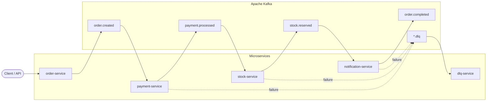

# EventFlow — Kafka Microservices

EventFlow is a learning and reference project that demonstrates an **event-driven microservices architecture** using **Apache Kafka**. It simulates an order processing flow where each step is handled by an independent service that communicates asynchronously through domain events.

The goal is to show how to design decoupled services, handle failures with a Dead Letter Queue (DLQ), and run the full stack locally with Docker/Podman.

---

## Project objectives

- Model a realistic order flow split into bounded contexts (orders, payments, inventory, notifications).
- Practice **event-driven architecture** with Kafka as the message broker.
- Build **independent, deployable services** with clear responsibilities.
- Provide a **reproducible local environment** (Kafka, UI, and all microservices in containers).
- Prepare the codebase for patterns such as idempotent consumers, retries, and DLQ handling.

---

## Proposed architecture

The flow starts when a client creates an order. Each service consumes events from Kafka, executes its logic, and publishes new events for downstream services.



### Service responsibilities

| Service | Role |
|---------|------|
| **order-service** | `POST /orders` — validates input, persists orders in **SQLite**, publishes `order.created`. |
| **payment-service** | Processes payments and publishes `payment.processed` or failure events. |
| **stock-service** | Reserves inventory and publishes `stock.reserved` events. |
| **notification-service** | Sends notifications when the flow completes (`order.completed`). |
| **dlq-service** | Consumes messages from Dead Letter Topics for inspection and reprocessing. |

> **Note:** Kafka producers/consumers are part of the proposed design. Services currently expose HTTP health endpoints and are ready for `@nestjs/microservices` integration.

---

## Tech stack

| Layer | Technology |
|-------|------------|
| Language | TypeScript |
| Framework | [NestJS](https://nestjs.com/) 11 |
| Runtime | Node.js 22 |
| Message broker | Apache Kafka 7.5 (Confluent Platform images) |
| Coordination | Zookeeper |
| Observability (local) | [Kafka UI](https://github.com/provectus/kafka-ui) |
| Containers | Docker / Podman |
| Monorepo | npm workspaces |
| Persistence (orders) | SQLite via TypeORM (`better-sqlite3`) |
| Validation | `class-validator` + `class-transformer` |

---

## Folder structure

```
eventflow-kafka-microservices/
├── docker/
│   ├── docker-compose.yml              # Kafka, Zookeeper, Kafka UI, kafka-init
│   ├── kafka-init/create-topics.sh       # Topic bootstrap (runs on compose up)
│   └── services/
│       ├── docker-compose.yml            # All NestJS microservices
│       ├── order-service/Dockerfile
│       ├── payment-service/Dockerfile
│       ├── stock-service/Dockerfile
│       ├── notification-service/Dockerfile
│       └── dlq-service/Dockerfile
├── services/                           # NestJS applications (source code)
│   ├── order-service/
│   ├── payment-service/
│   ├── stock-service/
│   ├── notification-service/
│   └── dlq-service/
├── shared/                             # @eventflow/shared — events, topics, envelopes
├── docs/
│   ├── PROJECT_DETAILS.md              # Full project guide (business + technical)
│   ├── EVENT_MODELING.md               # Core events, topics, envelope, POST /orders
│   ├── EVENT_CATALOG.md                # Full event catalog reference
│   └── RETRY_DLQ.md                    # Retry and DLQ strategy
├── scripts/                            # Automation scripts (planned)
├── .env                                # Local environment variables
├── .dockerignore
├── package.json                        # npm workspaces root
└── README.md
```

---

## Prerequisites

- **Node.js** 22+ and **npm** 11+
- **Docker** or **Podman** + **podman-compose** (Fedora)
- Ports available: `2181`, `9092`, `8080`, `3001`–`3005`

---

## Running the environment

### 1. Clone and configure

```bash
git clone <repository-url>
cd eventflow-kafka-microservices
cp .env.example .env   # adjust variables if needed
```

### 2. Start infrastructure (Kafka)

Creates the shared Docker network `eventflow-network` and **all Kafka topics** (including DLQ) via the `kafka-init` service.

**Docker:**

```bash
docker compose -f docker/docker-compose.yml up -d
```

**Podman (Fedora):**

```bash
podman-compose -f docker/docker-compose.yml up -d
```

| Component | URL / Address |
|-----------|----------------|
| Kafka (host) | `localhost:9092` |
| Kafka (Docker network) | `kafka:29092` |
| Kafka UI | http://localhost:8080 |
| Zookeeper | `localhost:2181` |

> Images use the `docker.io/` prefix so Podman can pull them without interactive short-name prompts.
>
> `kafka-init` runs once after Kafka is ready. `kafka-ui` starts only after topics are created.

### 3. Start all microservices (Docker)

Requires infrastructure from step 2.

```bash
podman-compose -f docker/services/docker-compose.yml up -d --build
```

Stop microservices:

```bash
podman-compose -f docker/services/docker-compose.yml down
```

Stop infrastructure:

```bash
podman-compose -f docker/docker-compose.yml down
```

### 4. Local development (without Docker for apps)

Install dependencies and run services individually:

```bash
npm install
npm run build
```

| Service | Port | Command |
|---------|------|---------|
| order-service | 3001 | `npm run start:order` |
| payment-service | 3002 | `npm run start:payment` |
| stock-service | 3003 | `npm run start:stock` |
| notification-service | 3004 | `npm run start:notification` |
| dlq-service | 3005 | `npm run start:dlq` |

Use `KAFKA_BOOTSTRAP_SERVERS=localhost:9092` from `.env` when running on the host.

### Health checks

Each service exposes:

- `GET /` — service info
- `GET /health` — health check
- `GET /events/catalog` — events produced/consumed by this service

### Event catalog & Kafka

Domain events, Kafka topics, payloads, and envelopes are defined in `@eventflow/shared`.

Each service runs as a **hybrid app** (HTTP + Kafka consumer) via `@nestjs/microservices`.

- [docs/PROJECT_DETAILS.md](docs/PROJECT_DETAILS.md) — step-by-step project guide (architecture, runbook, happy path)
- [docs/PROJECT_DETAILS.md](docs/PROJECT_DETAILS.md) — end-to-end guide (business + technical)
- [docs/EVENT_MODELING.md](docs/EVENT_MODELING.md) — core events, partitions, retention, envelope
- [docs/EVENT_CATALOG.md](docs/EVENT_CATALOG.md) — full event list and ownership
- [docs/RETRY_DLQ.md](docs/RETRY_DLQ.md) — retry and DLQ handling

Core flow: `order.created → payment.processed → stock.reserved → notification.sent`

```bash
curl http://localhost:3001/events/catalog   # order-service
curl http://localhost:3005/events/catalog   # dlq-service (full system catalog)
```

#### End-to-end flow (Kafka)

1. Start infrastructure and microservices (see [Running the environment](#running-the-environment)).
2. Trigger the happy path:

```bash
curl -X POST http://localhost:3001/orders \
  -H 'Content-Type: application/json' \
  -d '{
    "customerId": "customer-1",
    "items": [{ "productId": "sku-1", "quantity": 2, "unitPrice": 49.9 }]
  }'
```

Event chain:

```
order.created → payment.processed → stock.reserved → notification.sent
```

3. Inspect messages in Kafka UI: http://localhost:8080

Re-run topic creation only (if needed):

```bash
./scripts/create-kafka-topics.sh
```

Example:

```bash
curl http://localhost:3001/health
# {"service":"order-service","status":"ok"}
```

### Build a single Docker image

From the repository root:

```bash
podman build -f docker/services/order-service/Dockerfile -t eventflow-order-service .
```

---

## Environment variables

| Variable | Default | Description |
|----------|---------|-------------|
| `KAFKA_BOOTSTRAP_SERVERS` | `localhost:9092` | Kafka broker (host development) |
| `ORDER_SERVICE_PORT` | `3001` | order-service HTTP port |
| `ORDER_DATABASE_PATH` | `./services/order-service/data/orders.sqlite` | SQLite file for orders |
| `PAYMENT_SERVICE_PORT` | `3002` | payment-service HTTP port |
| `STOCK_SERVICE_PORT` | `3003` | stock-service HTTP port |
| `NOTIFICATION_SERVICE_PORT` | `3004` | notification-service HTTP port |
| `DLQ_SERVICE_PORT` | `3005` | dlq-service HTTP port |

Inside Docker, microservices use `KAFKA_BOOTSTRAP_SERVERS=kafka:29092` automatically via `docker/services/docker-compose.yml`.

---

## License

UNLICENSED — private learning project.
