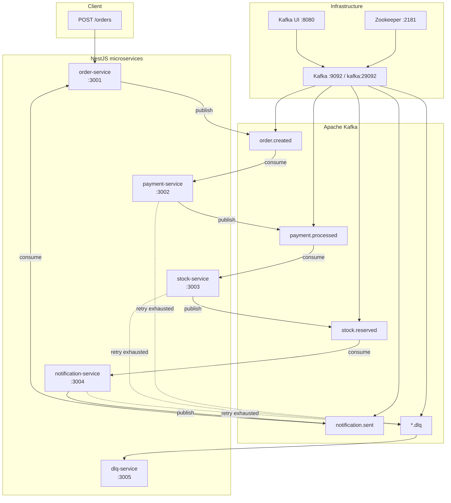
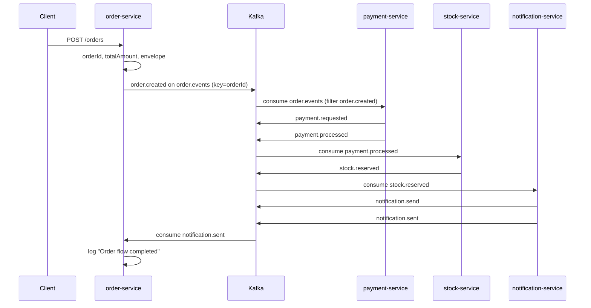

# EventFlow — Project Details

This document explains how the **EventFlow** project works end to end: the business problem it models, how microservices collaborate through Kafka, and the technical building blocks you need to run and extend the system locally.

For quick commands, see the [README](../README.md). For **all system rules**, see [RULES.md](./RULES.md).

---

## Table of contents

1. [What is EventFlow?](#1-what-is-eventflow)
2. [Business perspective](#2-business-perspective)
3. [Technical perspective](#3-technical-perspective)
4. [End-to-end walkthrough](#4-end-to-end-walkthrough-one-order)
5. [References](#5-references)

---

## 1. What is EventFlow?

**EventFlow** is a learning and reference implementation of an **event-driven order processing system**. It simulates an e-commerce checkout where placing an order triggers asynchronous steps—payment, inventory reservation, and customer notification—each owned by an independent microservice.

### Problem it solves

In a monolithic application, order, payment, stock, and notifications are often tangled in one codebase and one database transaction. That coupling makes it hard to:

- Scale hot paths independently (e.g. payment vs. notifications)
- Survive partial failures without blocking the whole request
- Evolve teams and domains at different speeds
- Audit *what happened* across a long-running business process

EventFlow demonstrates the alternative: **choreography via domain events**. The HTTP API only *starts* the process; each bounded context reacts to events it cares about and publishes the next facts. Kafka carries those facts reliably between services.

---

## 2. Business perspective

### 2.1 Order processing flow

#### Happy path

When a customer places an order, the system runs a linear saga (no central orchestrator):

```
POST /orders  →  order.created  →  payment.processed  →  stock.reserved  →  notification.sent
```

| Step | Business meaning |
|------|------------------|
| **Order created** | The business accepted the order; fulfillment can begin. |
| **Payment processed** | Money was captured (or authorized); it is safe to allocate inventory. |
| **Stock reserved** | Products are held for this order; overselling is avoided. |
| **Notification sent** | The customer was informed (e.g. confirmation email); the flow is complete from their perspective. |

The **order-service** logs completion when it consumes `notification.sent`—that event is the terminal signal for the happy path.

#### Failure and compensation paths

The catalog models branches that production systems need. Consumers exist for these events; the demo handlers mostly log today.

| Event | Business meaning | Who reacts |
|-------|------------------|------------|
| `payment.failed` | Payment could not be completed; order should not proceed to stock. | order-service (compensation log), notification-service (alert customer) |
| `stock.failed` | Inventory could not be reserved after payment. | order-service, notification-service |
| `order.cancelled` | Order voided before or during fulfillment. | payment-service (skip work), stock-service (`stock.released`), notification-service |
| `notification.failed` | Delivery channel failed. | dlq-service (observability) |

**Retry vs. DLQ:** Transient handler errors are retried on the **same topic** with exponential backoff (default: 3 attempts, 1s → 2s). After exhaustion, a structured `event.failure` payload is published to `{topic}.dlq` and **dlq-service** logs it for inspection. See [RETRY_DLQ.md](./RETRY_DLQ.md).

> **Demo note:** `payment-service` currently always publishes `payment.processed` on `order.created`. The `payment.failed` path is wired (topics, consumers, catalog) but not triggered by default business logic—you would extend `PaymentService` to emit it when simulating declines.

### 2.2 Role of each microservice

| Service | Port (default) | Business responsibility |
|---------|----------------|-------------------------|
| **order-service** | 3001 | `POST /orders` with **class-validator**, persists to **SQLite**, publishes `order.created`. Updates order status from Kafka (`notification.sent` → completed, failures → failed/cancelled). |
| **payment-service** | 3002 | Charges the order: on `order.created`, records `payment.requested` then `payment.processed`. Can react to `order.cancelled`. |
| **stock-service** | 3003 | Reserves inventory after successful payment: `payment.processed` → `stock.reserved`. On cancellation, publishes `stock.released`. |
| **notification-service** | 3004 | Customer communications: `stock.reserved` → `notification.send` → `notification.sent`. Also listens for `payment.failed` and `order.cancelled`. |
| **dlq-service** | 3005 | Operational safety net: consumes all `*.dlq` topics plus `notification.failed`, logs failures for triage and future reprocessing. |

Each service is a **bounded context**: it owns its data and only exposes facts as events. No service calls another’s HTTP API in the core flow.

### 2.3 Core domain events (business language)

Eleven event types exist; five define the **core system story** (`CORE_SYSTEM_EVENTS` in `@eventflow/shared`):

| Event | In plain language |
|-------|-------------------|
| `order.created` | “We have a new order to fulfill.” |
| `payment.processed` | “The customer paid; reserve stock next.” |
| `payment.failed` | “Payment did not go through; stop fulfillment.” |
| `stock.reserved` | “Items are held; notify the customer.” |
| `notification.sent` | “The customer was notified; this order’s pipeline is done.” |

**Supporting events** (same envelope standard, used for internal steps or extended flows):

| Event | In plain language |
|-------|-------------------|
| `order.cancelled` | Order was voided. |
| `payment.requested` | Payment attempt started (audit trail). |
| `stock.released` | Reservation returned to available pool. |
| `stock.failed` | Could not reserve stock. |
| `notification.send` | Outbound message queued. |
| `notification.failed` | Could not deliver notification. |

Full ownership matrix: [EVENT_CATALOG.md](./EVENT_CATALOG.md).

### 2.4 Why event-driven architecture and Kafka?

| Concern | How EventFlow addresses it |
|---------|----------------------------|
| **Decoupling** | Services depend on event contracts in `@eventflow/shared`, not on each other’s APIs. |
| **Resilience** | A slow notification service does not block order creation; messages buffer in Kafka. |
| **Scalability** | Consumer groups scale horizontally; partition key `orderId` keeps per-order ordering. |
| **Traceability** | `correlationId` (order id) and `causationId` (parent `eventId`) link the story across topics. |
| **Evolution** | New consumers can subscribe without changing producers; `version` supports schema drift. |

Kafka is the **durable log** between services: at-least-once delivery, replay, and DLQ companions per topic make failures visible instead of silent.

---

## 3. Technical perspective

### 3.1 Architecture diagram



**Hybrid apps:** Every service runs HTTP (health, catalog, `POST /orders` on order-service only) **and** a Kafka consumer via `@nestjs/microservices` (`main.ts` calls `connectMicroservice` + `startAllMicroservices`).

### 3.2 Monorepo structure

```
eventflow-kafka-microservices/
├── docker/
│   ├── docker-compose.yml           # Zookeeper, Kafka, kafka-init, Kafka UI
│   ├── kafka-init/create-topics.sh  # Topic bootstrap (11 base + 11 DLQ)
│   └── services/docker-compose.yml  # All five NestJS services
├── services/
│   ├── order-service/               # HTTP + Kafka producer/consumer
│   ├── payment-service/
│   ├── stock-service/
│   ├── notification-service/
│   └── dlq-service/
├── shared/                          # @eventflow/shared (npm workspace)
├── docs/                            # EVENT_*, RETRY_DLQ, this file
├── scripts/create-kafka-topics.sh   # Re-run topic creation from host
├── .env                             # Local defaults
└── package.json                     # npm workspaces root
```

**Workspaces:** Root `package.json` includes `shared` and `services/*`. Build shared first: `npm install && npm run build`.

### 3.3 Running locally

#### Prerequisites

- Node.js 22+, npm 11+
- Docker or Podman + compose plugin
- Free ports: `2181`, `9092`, `8080`, `3001`–`3005`

#### Step 1 — Infrastructure (Kafka)

Creates network `eventflow-network` and **22 topics** (11 events + 11 DLQ):

```bash
docker compose -f docker/docker-compose.yml up -d
# or: podman-compose -f docker/docker-compose.yml up -d
```

| Component | Access |
|-----------|--------|
| Kafka (host) | `localhost:9092` |
| Kafka (Docker network) | `kafka:29092` |
| Kafka UI | http://localhost:8080 |
| Zookeeper | `localhost:2181` |

`kafka-init` runs once, waits for Kafka, then executes `create-topics.sh`. `kafka-ui` starts after init succeeds.

#### Step 2 — Microservices (Docker)

Requires step 1 (external network `eventflow-network`):

```bash
docker compose -f docker/services/docker-compose.yml up -d --build
```

Inside containers, `KAFKA_BOOTSTRAP_SERVERS=kafka:29092` is set automatically.

#### Step 3 — Microservices (host development)

```bash
cp .env.example .env.example.local   # optional
npm install
npm run build

# Terminal per service (Kafka must be up on localhost:9092)
npm run start:order        # :3001
npm run start:payment      # :3002
npm run start:stock        # :3003
npm run start:notification # :3004
npm run start:dlq          # :3005
```

Use `KAFKA_BOOTSTRAP_SERVERS=localhost:9092` from `.env` when apps run on the host.

#### Step 4 — Trigger the flow

```bash
curl -X POST http://localhost:3001/orders \
  -H 'Content-Type: application/json' \
  -d '{
    "customerId": "customer-1",
    "items": [{ "productId": "sku-1", "quantity": 2, "unitPrice": 49.9 }]
  }'
```

Inspect topics in Kafka UI or:

```bash
curl http://localhost:3001/events/catalog
curl http://localhost:3005/events/catalog   # dlq-service: full catalog view
```

Re-create topics only (if needed):

```bash
./scripts/create-kafka-topics.sh
```

### 3.4 Environment variables

| Variable | Default | Used by |
|----------|---------|---------|
| `KAFKA_BOOTSTRAP_SERVERS` | `localhost:9092` | All services (host); `kafka:29092` in Docker |
| `ORDER_SERVICE_PORT` / `PORT` | `3001` | order-service |
| `PAYMENT_SERVICE_PORT` / `PORT` | `3002` | payment-service |
| `STOCK_SERVICE_PORT` / `PORT` | `3003` | stock-service |
| `NOTIFICATION_SERVICE_PORT` / `PORT` | `3004` | notification-service |
| `DLQ_SERVICE_PORT` / `PORT` | `3005` | dlq-service |
| `KAFKA_TOPIC_PARTITIONS` | `3` | kafka-init |
| `KAFKA_TOPIC_REPLICATION_FACTOR` | `1` | kafka-init |
| `KAFKA_TOPIC_RETENTION_MS` | `604800000` (7 days) | kafka-init |
| `KAFKA_TOPIC_CLEANUP_POLICY` | `delete` | kafka-init |
| `KAFKA_RETRY_MAX_ATTEMPTS` | `3` | `KafkaRetryExecutor` |
| `KAFKA_RETRY_BASE_DELAY_MS` | `1000` | retry backoff |
| `KAFKA_RETRY_MAX_DELAY_MS` | `30000` | retry cap |
| `KAFKA_RETRY_BACKOFF_MULTIPLIER` | `2` | exponential backoff |
| `KAFKA_FROM_BEGINNING` | unset (`false`) | consumer replay |

### 3.5 Event envelope standard

Every Kafka message value is an `EventEnvelope<T>` from `@eventflow/shared`:

| Field | Required | Purpose |
|-------|----------|---------|
| `eventId` | yes | UUID v4; unique per message; idempotency key |
| `eventType` | yes | Canonical name; **equals Kafka topic name** |
| `version` | yes | Schema version (current: `1.0`) |
| `timestamp` | yes | ISO-8601 UTC at publish time |
| `correlationId` | yes | Business flow id — **`orderId`** for order flows |
| `causationId` | no | `eventId` of the event that caused this one |
| `source` | yes | Producing service (e.g. `order-service`) |
| `payload` | yes | Domain data; **must include `orderId`** |

Factory: `createEventEnvelope()` — auto-fills `eventId`, `timestamp`, and `version`.

Example:

```json
{
  "eventId": "550e8400-e29b-41d4-a716-446655440000",
  "eventType": "order.created",
  "version": "1.0",
  "timestamp": "2026-05-19T12:00:00.000Z",
  "correlationId": "7c9e6679-7425-40de-944b-e07fc1f90ae7",
  "source": "order-service",
  "payload": {
    "orderId": "7c9e6679-7425-40de-944b-e07fc1f90ae7",
    "customerId": "customer-1",
    "items": [{ "productId": "sku-1", "quantity": 2, "unitPrice": 49.9 }],
    "totalAmount": 99.8,
    "currency": "BRL"
  }
}
```

Wire format: `EventPublisher` copies envelope fields into Kafka **headers** (`envelopeToKafkaHeaders`) and sets the message **key** to `orderId`.

Details: [EVENT_MODELING.md](./EVENT_MODELING.md), `shared/src/events/envelope-spec.ts`.

### 3.6 Kafka topics, partitions, keys, retention

#### Topic layout

- **Tópicos agregados:** `order.events` (`order.created`), `payment.events` (`payment.processed`, `payment.failed`)
- **Demais eventos:** um tópico por `eventType` (ex.: `stock.reserved`)
- **DLQ:** `{topic}.dlq` para cada tópico base
- Criados por `docker/kafka-init/create-topics.sh` — ver [RULES.md](./RULES.md)

Tópicos principais do `kafka-init`:

`order.events`, `order.cancelled`, `payment.requested`, `payment.events`, `stock.reserved`, `stock.released`, `stock.failed`, `notification.send`, `notification.sent`, `notification.failed` (+ DLQs)

#### Partitions and message key

| Setting | Default | Source |
|---------|---------|--------|
| Partitions | 3 | `KAFKA_TOPIC_PARTITIONS` / `DEFAULT_TOPIC_PARTITIONS` |
| Message key | `orderId` | `PARTITION_KEY_FIELD` in `shared/src/kafka/topic-config.ts` |
| Effect | All events for one order map to the same partition → **per-order ordering** | `resolvePartitionKey(envelope)` |

Consumer groups (one per service, enables horizontal scale up to partition count):

| Service | Group id (config) | No broker (Nest `-server`) |
|---------|-------------------|----------------------------|
| order-service | `eventflow.order-service` | `eventflow.order-service-server` |
| payment-service | `eventflow.payment-service` | `eventflow.payment-service-server` |
| stock-service | `eventflow.stock-service` | `eventflow.stock-service-server` |
| notification-service | `eventflow.notification-service` | `eventflow.notification-service-server` |
| dlq-service | `eventflow.dlq-service` | `eventflow.dlq-service-server` |

**Payment horizontal scale:** `payment-service-1`, `payment-service-2` (mesmo groupId). Ver [RULES.md §4](./RULES.md#4-consumer-groups-e-escalabilidade-horizontal).

#### Retention

| Setting | Default | Meaning |
|---------|---------|---------|
| `retention.ms` | 604800000 (7 days) | Messages deleted after retention |
| `cleanup.policy` | `delete` | Old segments removed (not compaction) |

DLQ topics use the same config. Override env vars before running `kafka-init`.

### 3.7 Retry and DLQ strategy

Implemented in `shared/src/kafka/retry/` and wrapped per service as `KafkaRetryRunner`:

```
Consume → handler throws?
  → attempt + 1 < maxAttempts? → sleep(backoff) → republish same topic + retry headers
  → else → publish EventFailurePayload to {topic}.dlq
```

Retry headers: `x-retry-count`, `x-retry-max`, `x-retry-at`, `x-original-topic`.

Default backoff: **1s → 2s → DLQ** (3 attempts). Policy env vars in `.env`.

Full specification: [RETRY_DLQ.md](./RETRY_DLQ.md).

### 3.8 Request flow: POST /orders → Kafka chain → completion



HTTP response from `POST /orders` returns immediately with `{ orderId, status: "pending", eventId }`—the rest is asynchronous.

### 3.9 Docker Compose layout

| File | Contents | Network |
|------|----------|---------|
| `docker/docker-compose.yml` | **Infra:** Zookeeper, Kafka, `kafka-init`, Kafka UI | Creates `eventflow-network` |
| `docker/services/docker-compose.yml` | **Apps:** all five NestJS services | Uses external `eventflow-network` |

Images use `docker.io/` prefix for Podman compatibility. Service Dockerfiles build from repo root context (`../..`) so `@eventflow/shared` is included.

### 3.10 Shared package `@eventflow/shared`

Published only inside the monorepo (`shared/package.json`). Built output: `shared/dist/`.

| Area | Path | Exports (examples) |
|------|------|---------------------|
| **Events** | `shared/src/events/` | `EventType`, `EventEnvelope`, `createEventEnvelope`, `EVENT_CATALOG`, payloads |
| **Kafka** | `shared/src/kafka/` | `getKafkaConsumerConfig`, `resolvePartitionKey`, `KafkaRetryExecutor`, topic defaults |
| **Core flow** | `core-events.ts` | `CORE_SYSTEM_EVENTS`, `CORE_EVENT_FLOW` |

Services import a single package so topic names, payload shapes, and retry behavior cannot drift.

**Key modules:**

- `event-catalog.ts` — producer/consumer ownership and descriptions
- `kafka-topics.ts` — topic names and `toDlqTopic()`
- `topic-config.ts` — partitions, retention, partition strategy
- `kafka-retry.executor.ts` — shared retry/DLQ engine
- `event-failure.ts` — `EventFailurePayload` for DLQ messages

---

## 4. End-to-end walkthrough (one order)

This section traces a single happy-path order from API call through `notification.sent`, listing **who publishes and who consumes** each event.

### Prerequisites

1. Infrastructure up: `docker compose -f docker/docker-compose.yml up -d`
2. All services up (Docker or five `npm run start:*` terminals)
3. Kafka UI open (optional): http://localhost:8080

### Steps

**1. Client creates an order**

```bash
curl -X POST http://localhost:3001/orders \
  -H 'Content-Type: application/json' \
  -d '{"customerId":"customer-1","items":[{"productId":"sku-1","quantity":2,"unitPrice":49.9}]}'
```

- **Service:** order-service (`OrdersController` → `OrdersService`)
- **Validation:** Global `ValidationPipe` + `class-validator` on `CreateOrderDto` / `OrderItemDto` (required fields, min quantities, optional `currency`)
- **Persistence:** Order + line items saved to **SQLite** (`ORDER_DATABASE_PATH`, TypeORM `synchronize: true` in dev)
- **Action:** Generates `orderId` (UUID), computes `totalAmount`, builds envelope with `correlationId = orderId`
- **Publishes:** `order.created` → topic `order.created`, key = `orderId`
- **HTTP response (201):** `{ orderId, status: "pending", totalAmount, currency, eventId, createdAt }`
- **Status updates:** Kafka consumers update SQLite (`completed` on `notification.sent`, `failed` on payment/stock failures)

---

**2. Payment processes the order**

- **Consumes:** `order.created` — **payment-service** (`PaymentEventsConsumer`, group `eventflow.payment-service`)
- **Handler:** `PaymentService.handleOrderCreated`
- **Publishes (internal audit):** `payment.requested` — same service, topic `payment.requested`
- **Publishes (success):** `payment.processed` — topic `payment.processed`, `causationId` = `payment.requested` event id

---

**3. Stock reserves inventory**

- **Consumes:** `payment.processed` — **stock-service** (`StockEventsConsumer`)
- **Handler:** `StockService.handlePaymentProcessed`
- **Publishes:** `stock.reserved` — topic `stock.reserved`, payload includes `reservationId`, `orderId`, `reservedAt`

---

**4. Notification informs the customer**

- **Consumes:** `stock.reserved` — **notification-service** (`NotificationEventsConsumer`)
- **Handler:** `NotificationService.handleStockReserved`
- **Publishes:** `notification.send` — internal step (channel `email`, template `order-completed`)
- **Publishes:** `notification.sent` — topic `notification.sent`, confirms delivery timestamp

---

**5. Order service marks the saga complete**

- **Consumes:** `notification.sent` — **order-service** (`OrderEventsConsumer.handleNotificationSent`)
- **Action:** Logs `Order flow completed for {orderId} — notification sent via {channel}`
- **Outcome:** Happy path finished; no further events required for this demo

---

### Event chain summary

| # | Event | Topic | Publisher | Consumer(s) |
|---|-------|-------|-----------|-------------|
| 1 | `order.created` | `order.created` | order-service | payment-service |
| 2 | `payment.requested` | `payment.requested` | payment-service | payment-service (catalog; optional internal) |
| 3 | `payment.processed` | `payment.processed` | payment-service | stock-service |
| 4 | `stock.reserved` | `stock.reserved` | stock-service | notification-service |
| 5 | `notification.send` | `notification.send` | notification-service | notification-service (internal step) |
| 6 | `notification.sent` | `notification.sent` | notification-service | order-service |

**Label:** `order.created → payment.processed → stock.reserved → notification.sent` (core flow; internal events omitted).

### If something fails along the way

1. Consumer handler throws → `KafkaRetryRunner` / `KafkaRetryExecutor` increments `x-retry-count`, backs off, republishes to the **same** topic.
2. After max attempts → `EventFailurePayload` published to e.g. `payment.processed.dlq`.
3. **dlq-service** consumes all `ALL_DLQ_TOPICS` and logs structured failure metadata (`originalEventType`, `correlationId`, error stack).

---

## 5. References

| Document | Description |
|----------|-------------|
| [RULES.md](./RULES.md) | **Regras consolidadas** — tópicos, partições, scale, producer, troubleshooting |
| [README.md](../README.md) | Quick start, ports, curl examples |
| [EVENT_CATALOG.md](./EVENT_CATALOG.md) | Full event list, producers, consumers, envelope example |
| [EVENT_MODELING.md](./EVENT_MODELING.md) | Core events, checklists, partition strategy, envelope |
| [RETRY_DLQ.md](./RETRY_DLQ.md) | Retry policy, headers, DLQ payload shape |

**Code anchors:**

- Envelope: `shared/src/events/envelope.ts`, `create-envelope.ts`
- Catalog: `shared/src/events/event-catalog.ts`
- Topics bootstrap: `docker/kafka-init/create-topics.sh`
- Order API: `services/order-service/src/orders/`
- Retry: `shared/src/kafka/retry/kafka-retry.executor.ts`

**HTTP discovery:**

```bash
curl http://localhost:3001/health
curl http://localhost:3001/events/catalog
```
